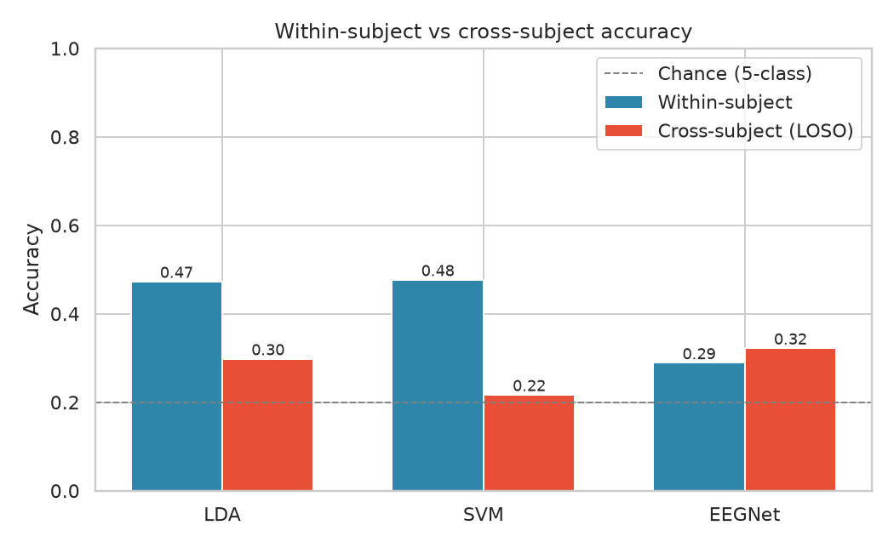
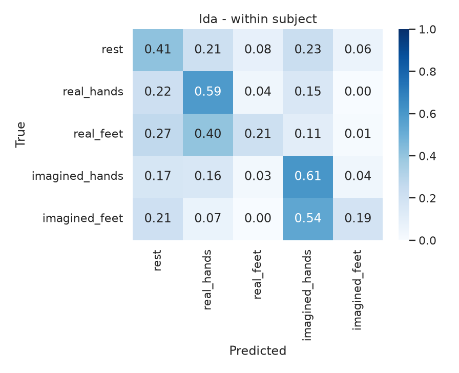
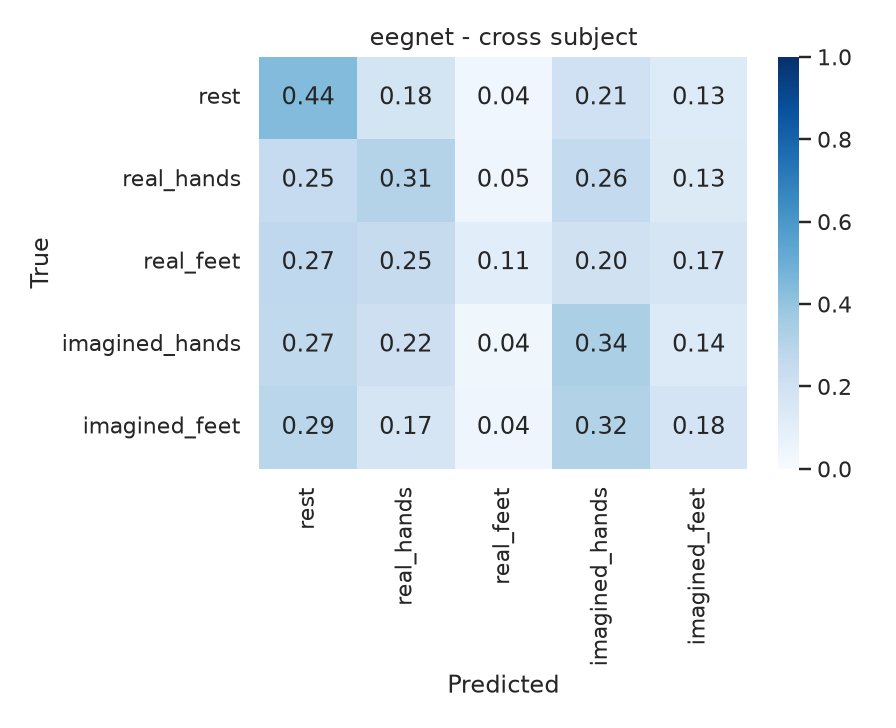

# EEG Motor Imagery Classifier

[](https://github.com/TechieGoku2623/EEG-Motor-Imagery-Classifier/actions/workflows/ci.yml)
[](https://www.python.org)
[](LICENSE)
[](https://physionet.org/content/eegmmidb/1.0.0/)
[](https://mne.tools)
[](https://pytorch.org)

My project on the [PhysioNet EEG Motor Movement/Imagery dataset](https://physionet.org/content/eegmmidb/1.0.0/).

I classify 64-channel EEG into five labels: rest, real hands, real feet, imagined hands, imagined feet. The idea is the same as a motor-imagery BCI: guess what the person is doing (or imagining) from the scalp signal.

I also wanted to see how much of that is just overfitting one person. So I trained CSP + LDA/SVM and a small EEGNet, then tested two ways:

- **within-subject** (train/test split on the same person)
- **leave-one-subject-out** (train on everyone else)

| | Same person | Held-out person |
|---|---:|---:|
| Chance / majority class | 20% / ~27% | 20% / ~27% |
| Best I got | CSP + SVM **47.7%** | EEGNet **32.2%** |

<p align="center">
  
</p>

Same-person numbers look okay. Held-out is a lot closer to chance. That was the main thing I wanted to check.

## What the code does

```text
download EDFs (wfdb) -> bandpass 8-30 Hz (MNE) -> 4 s epochs
        -> CSP + LDA / SVM
        -> EEGNet
        -> metrics + plots in results/
```

- `data/download.py` pulls S001-S020, runs 3-14. These files are EDF+, so I used `wfdb.dl_files` (not `dl_database`, that 404s looking for `.hea` files).
- `data/preprocess.py` maps T0/T1/T2 using the run number. T1/T2 mean left/right fist on some runs and hands/feet on others. I dump rest so it isn't half the dataset.
- `models/csp_baseline.py` and `models/train_cnn.py` use the same two splits.
- Not a realtime BCI. Just offline classification on the public recordings.

## Why I set it up this way

EEG at the scalp is noisy. Motor imagery shows up as mu/beta (about 8-30 Hz), so I filter to that band and let CSP find useful channel combinations.

The PhysioNet annotations are only T0/T1/T2. If I ignored the run type, feet and fists would share a label.

Rest happens every trial. If I keep all of it, a dummy "always rest" model looks decent. I downsample rest per subject and report macro-F1 as well as accuracy.

A lot of MI papers only do within-subject splits. I ran LOSO on the same epochs so I could compare.

CSP did better when I had data from that person (~48%). EEGNet was worse there (not enough trials per subject) but a bit better when I held a person out (32% vs LDA 30%). SVM basically failed LOSO (22%). So I wouldn't throw CSP away just because a CNN exists.

## Results

4,959 epochs, 20 subjects. More detail in [`results/REPORT.md`](results/REPORT.md) and [`docs/METHOD.md`](docs/METHOD.md).

| Method | Within acc | Within F1 | LOSO acc | LOSO F1 |
|---|---:|---:|---:|---:|
| CSP + LDA | 0.473 | 0.406 | 0.298 | 0.191 |
| CSP + SVM | **0.477** | **0.461** | 0.217 | 0.200 |
| EEGNet | 0.289 | 0.264 | **0.322** | **0.274** |

<p align="center">
  
  
</p>
<p align="center"><sub>LDA on the same subject (left). EEGNet on a held-out subject (right).</sub></p>

Hands are easier than feet (more trials). Real vs imagined of the same limb gets mixed with rest a lot.

## How to run

```bash
python3 -m pip install -r requirements.txt

python3 data/download.py --subjects 1-20 --runs 3-14
python3 data/preprocess.py
python3 models/csp_baseline.py
python3 models/train_cnn.py --epochs 10 --patience 4 --decimate 2
python3 models/visualize.py
```

Python 3.11+. I ran training on CPU. Raw EDFs and `.npz` files are gitignored.

```text
config.py          subjects, class map, filter settings
data/              download + preprocess
models/            CSP, EEGNet, plotting
notebooks/         quick look at class counts
results/           numbers and figures from my run
docs/METHOD.md     labels, hyperparameters, extra plots
```

## License / data

Code is [MIT](LICENSE). The EEG is from PhysioNet; see their [terms](https://physionet.org/content/eegmmidb/1.0.0/). Dataset papers are listed in [`CITATION.cff`](CITATION.cff).

```bibtex
@article{schalk2004bci2000,
  title  = {BCI2000: a general-purpose brain-computer interface (BCI) system},
  author = {Schalk, Gerwin and McFarland, Dennis J. and Hinterberger, Thilo
            and Birbaumer, Niels and Wolpaw, Jonathan R.},
  journal = {IEEE Transactions on Biomedical Engineering},
  volume = {51}, number = {6}, year = {2004}
}
```
