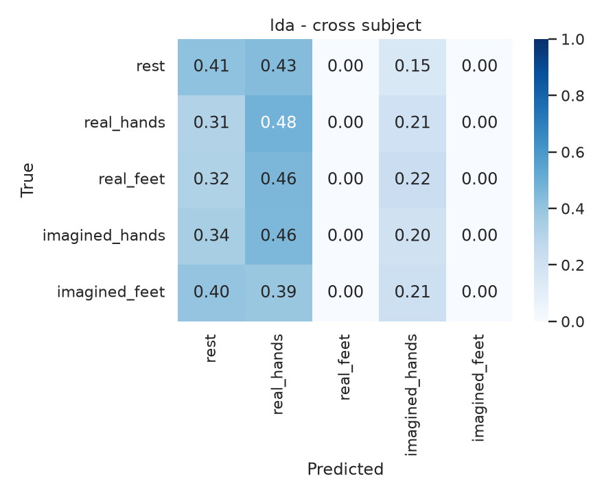
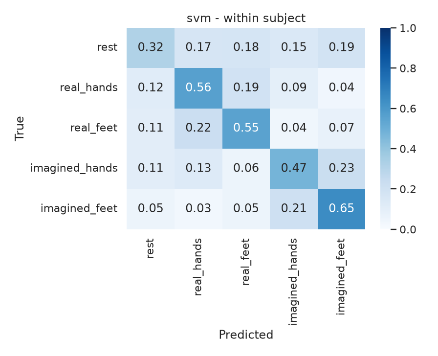
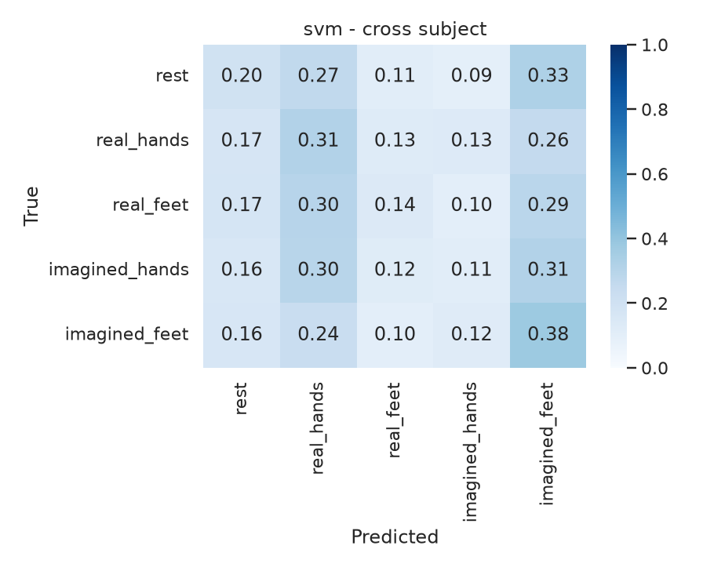
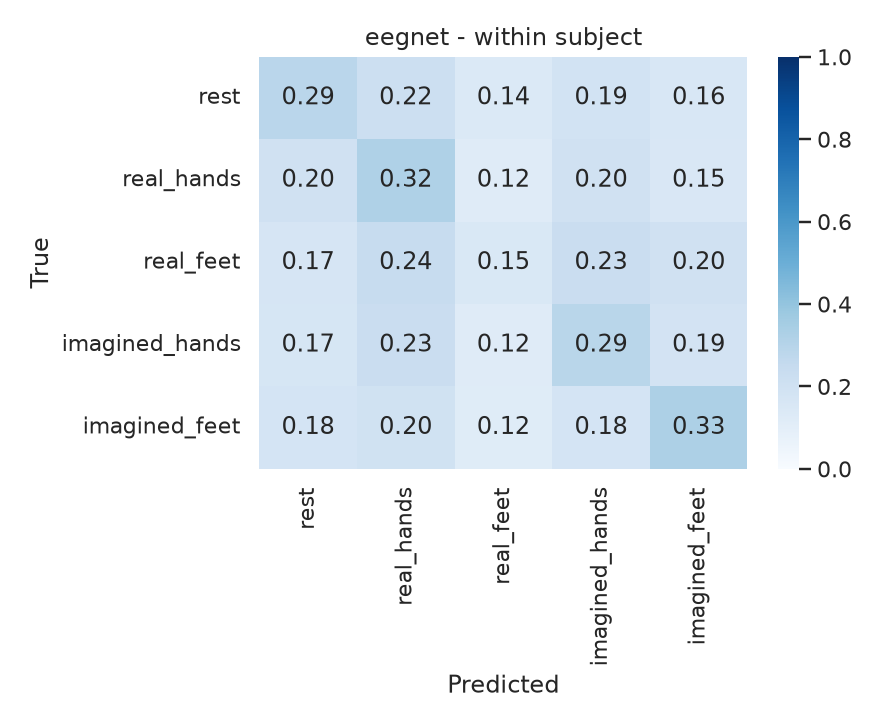

# Methods

Notes on how I processed EEGMMIDB and trained the models. See the [README](../README.md) for the short version.

## Labels

The EDF annotations are only `T0`, `T1`, `T2`. What they mean depends on the run:

| Runs | Task | T0 | T1 | T2 |
|---|---|---|---|---|
| 3, 7, 11 | Real left vs right fist | rest | real hands | real hands |
| 4, 8, 12 | Imagined left vs right fist | rest | imagined hands | imagined hands |
| 5, 9, 13 | Real fists vs feet | rest | real hands | real feet |
| 6, 10, 14 | Imagined fists vs feet | rest | imagined hands | imagined feet |

I merged left/right fist into `*_hands` because I cared about hands vs feet, not side. I skipped runs 1-2 (eyes open/closed).

T0 is on every trial, so rest is about half the raw epochs. I downsampled rest per subject to match the biggest motor class. Use `--keep-all-rest` if you want all of them.

| Class | Count | Share |
|---|---:|---:|
| rest | 1,359 | 27.4% |
| real_hands | 1,345 | 27.1% |
| imagined_hands | 1,351 | 27.2% |
| real_feet | 455 | 9.2% |
| imagined_feet | 449 | 9.1% |
| **Total** | **4,959** | 64 ch x 641 samples, 0-4 s |

I downloaded with `wfdb.dl_files`. `dl_database` looks for `.hea` files that this dataset doesn't have.

## Preprocessing

1. Load EDF in MNE, `eegbci.standardize` for channel names, 10-10 montage
2. FIR bandpass 8-30 Hz
3. Epoch 0-4 s after each event
4. Save `X`, `y`, `subjects`, `runs`

For the CNN I z-scored each channel using train-set stats only, and kept every 2nd sample (80 Hz). That's still above 2x 30 Hz.

## Models

CSP: 6 log-variance components, Ledoit-Wolf cov, then StandardScaler, then LDA (shrinkage) or RBF SVM (`class_weight=balanced`).

EEGNet: based on Lawhern et al. 2018. Temporal conv, depthwise spatial conv, separable conv, dropout 0.5, weighted cross-entropy, Adam 1e-3, early stopping. I kept it small because each subject only has ~250 trials.

## Splits

- Within-subject: stratified 80/20 inside each person, then pool the predictions
- Cross-subject: leave one subject out, 20 folds

Seed 42. I report accuracy and macro-F1. Times are CPU wall clock.

## Extra confusion matrices

  
  

LDA within-subject / LOSO

  
  

SVM within-subject / LOSO

  
  

EEGNet within-subject / LOSO

## If I keep working on this

- Use all 109 subjects
- Try Euclidean alignment or Riemannian methods for LOSO
- Train EEGNet longer on a GPU
- Add a left vs right hand task so it's easier to compare with papers
- Nested CV for CSP components / SVM C without leaking subjects
